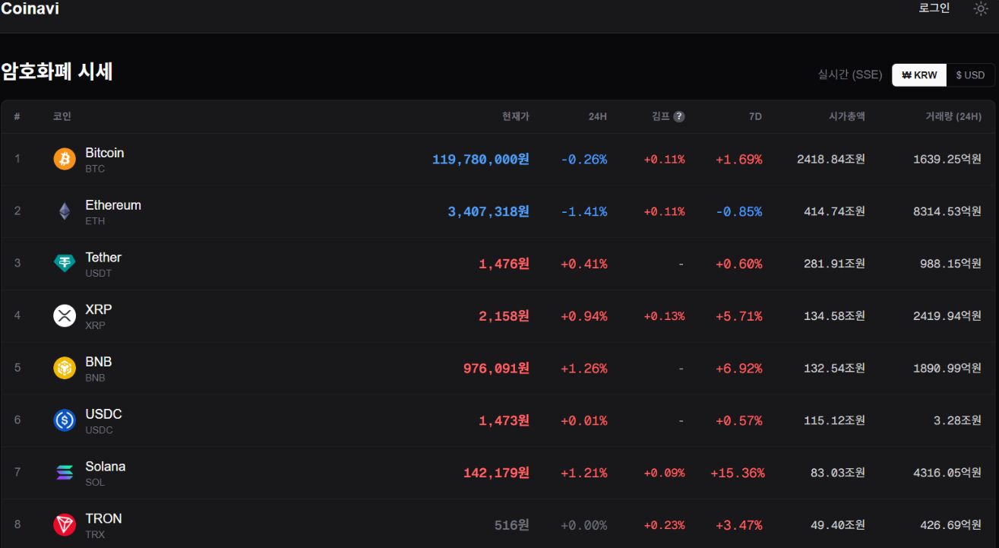
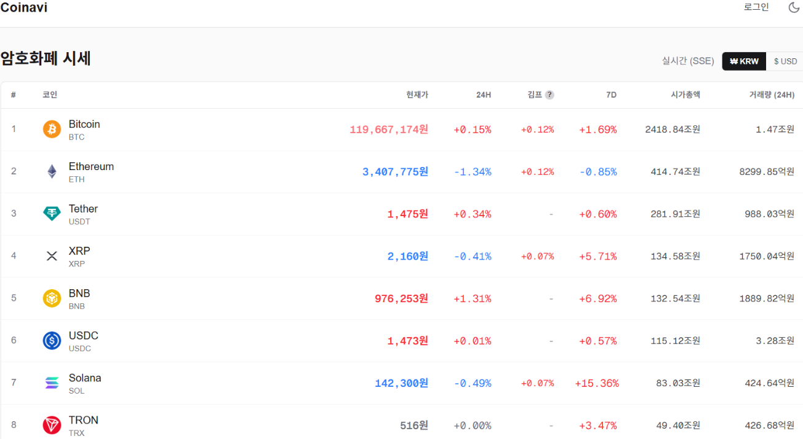
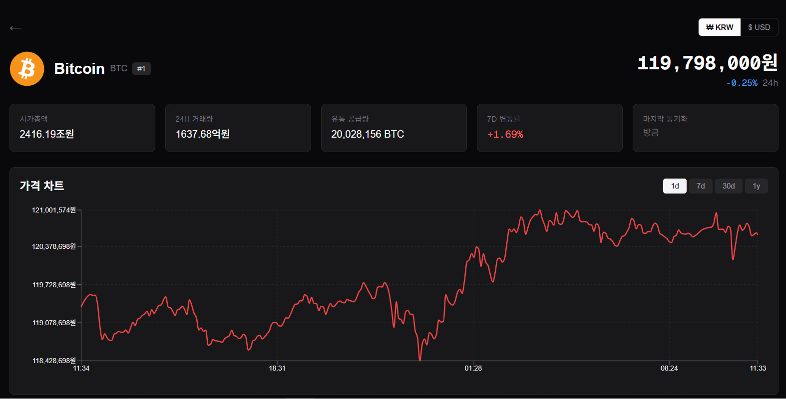
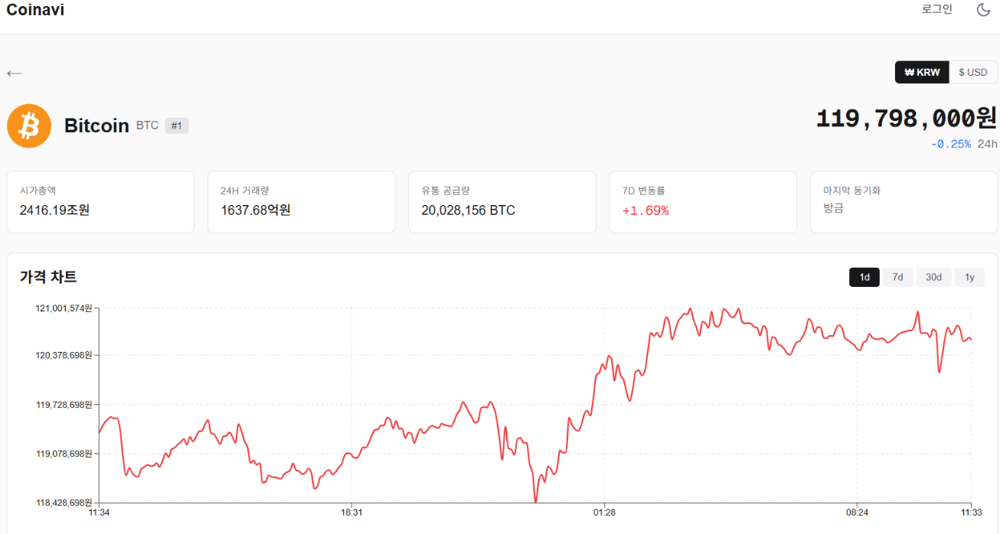

# coinavi-client

> **흩어진 내 코인을 한 곳에서.** 한국 사용자를 위한 통합 암호화폐 자산 플랫폼의 프론트엔드.

거래소 API 키 한 번 등록으로 보유 자산을 통합 조회 + 실시간 시세 + 김치 프리미엄 + 종목별 차트까지 한 화면에 보여준다.

## 📸 화면

### 메인 — 실시간 시세

도넛 차트 없는 *공개 시세 페이지*. SSE 로 푸시 받아 1초 이내 갱신. 김치 프리미엄·24h·7d 변동률 한 행에.

| 다크 모드 | 라이트 모드 |
| :---: | :---: |
|  |  |

### 단건 코인 페이지 — 시세 + 통계 + 차트

코인 클릭 시 진입. recharts LineChart + range 토글 (1d/7d/30d/1y).

| 다크 모드 | 라이트 모드 |
| :---: | :---: |
|  |  |

> 📌 **포트폴리오 / 거래소 키 관리** 스크린샷은 평가손익·온보딩 가이드까지 완성된 다음 추가 예정.

## ✨ 주요 기능

| 기능 | 비고 |
| --- | --- |
| **실시간 시세** | SSE 푸시 — Upbit + Binance WebSocket → 서버 → 브라우저. 폴링 0회 |
| **김치 프리미엄** | 같은 코인의 Upbit vs Binance×환율 가격 차이. 양 거래소 실시간 수신 시만 표시 |
| **코인 단건 페이지** | 시세 · 시총 · 거래량 · 7d 변동 · 차트 (range 토글) · CoinGecko 설명 |
| **통합 포트폴리오** | 도넛 차트 + 종목별 평가금액 · 비중 (비중 desc 정렬) |
| **거래소 키 관리** | AES-256-GCM 백엔드 암호화 · Upbit/Binance 가이드 탭 · 평문 절대 노출 X |
| **KRW ↔ USD 토글** | 시세 · 차트 · 평가금액 모두 환산. URL `?currency=USD` 로 상태 동기화 |
| **다크 / 라이트** | 한국 거래소 컨벤션 (상승 빨강 · 하락 파랑) |
| **밈코인 KRW 정밀도** | 시바이누 등 0.00001원 단위 자산도 정수 절삭 안 됨 (동적 자릿수) |
| **인증** | Google OAuth + JWT (silent refresh 자동 처리) |

## 🛠️ Stack

- **Next.js 16** (App Router · React Server Components · Turbopack)
- **React 19** + **TypeScript 5**
- **Tailwind CSS 4**
- **recharts** — 시계열 차트 + 도넛 차트
- **@react-oauth/google** — Google OAuth ID Token

## 🚀 Getting Started

```bash
npm install
cp .env.example .env.local
# .env.local — NEXT_PUBLIC_API_BASE_URL 등 편집
npm run dev
```

개발 서버: <http://localhost:3000>

백엔드 서버는 [coinavi-server](https://github.com/intern-poc/coinavi-server) 참고. 기본 base URL `http://localhost:8080`.

### Scripts

| 명령 | 설명 |
| --- | --- |
| `npm run dev` | 개발 서버 (Turbopack) |
| `npm run build` | 프로덕션 빌드 |
| `npm run start` | 프로덕션 실행 |
| `npm run lint` | ESLint |

## 🗺️ 라우트

| 경로 | 인증 | 설명 |
| --- | --- | --- |
| `/` | 공개 | 시세 페이지 (SSE) |
| `/coins/[identifier]` | 공개 | 코인 단건 (시세 · 통계 · 차트) |
| `/portfolio` | 필요 | 통합 자산 (도넛 차트 + 종목 비중) |
| `/exchange-keys` | 필요 | 거래소 API 키 관리 |
| `/login` | 공개 | Google OAuth 로그인 |

## 📦 디렉토리 구조

```
src/
├── app/                          # Next.js App Router 라우트
│   ├── (home)/                   # /  — 시세 페이지
│   ├── coins/[identifier]/       # /coins/{id} — 단건 페이지
│   ├── portfolio/                # /portfolio
│   ├── exchange-keys/            # /exchange-keys
│   └── login/                    # /login
├── components/                   # 공용 UI
│   ├── header.tsx                # 전역 헤더 (로그인 + 포트폴리오 메뉴 + 다크모드)
│   ├── back-button.tsx           # router.back() + fallback URL
│   ├── currency-toggle.tsx       # KRW/USD 토글 (URL 동기화)
│   ├── theme-toggle.tsx          # 다크/라이트
│   └── tooltip.tsx               # 호버 + 클릭 토글 + 외부 클릭 닫힘
├── features/                     # 기능 단위 모듈
│   ├── auth/                     # OAuth + 토큰 관리 + silent refresh
│   ├── coins/                    # 시세 리스트 (SSE + 김프 + 페이지네이션)
│   ├── coin-detail/              # 단건 페이지 컴포넌트
│   ├── exchange-keys/            # API 키 CRUD + 거래소 가이드
│   └── portfolio/                # 도넛 차트 + 종목 리스트 + 새로고침 polling
├── lib/
│   ├── api.ts                    # 백엔드 호출 + CommonResponse unwrap + 401 자동 재시도
│   ├── auth.ts                   # access token 메모리 저장
│   └── format.ts                 # KRW/USD 포맷터 (동적 자릿수, 변동률, 색상)
└── types/                        # 도메인 타입
    ├── api.ts                    # CommonResponse, Page
    ├── coin.ts                   # CoinSummary, CoinDetail
    ├── chart.ts                  # CoinChart, ChartRange
    ├── portfolio.ts              # Portfolio, CoinHolding, CollectionJob
    ├── exchange-key.ts           # ExchangeApiKey, ExchangeCode
    ├── live-price-frame.ts       # SSE frame
    └── user.ts
```

## 🎨 디자인 결정

- **SSE 푸시** — 1초 polling 대체. 평균 지연 1초 → <50ms, HTTP 호출 매초 1회 → connection 1개 유지
- **URL state** — currency / range / page 모두 query string 동기화. 새로고침·공유 시 상태 유지
- **테이블 `table-fixed`** — SSE 갱신마다 컬럼 너비 jitter 방지. `colgroup` 으로 한 곳에서 너비 통제
- **차트 라이브러리 — recharts** — React JSX 친화 + 적은 번들 크기. 추후 lightweight-charts 등 교체 시 `CoinChart` DTO 만 의존
- **포트폴리오 새로고침** — `POST /refresh` → 202 + jobId → 1.5초 polling. 백엔드 워커가 비동기로 거래소 호출, 프론트는 진행 표시
- **밈코인 KRW 동적 자릿수** — ≥100원 정수, ≥1원 2자리, ≥0.01원 4자리, < 0.01원 8자리
- **한국 거래소 색상 컨벤션** — 양수 빨강·음수 파랑 (Upbit/Bithumb 표준)

## 🌿 브랜치 전략

- `main` — 배포 (직접 커밋 금지)
- `develop` — 개발 기본 (PR base)
- `feature/*`, `fix/*` — 작업 브랜치

## 📎 관련 리포

- [coinavi-server](https://github.com/intern-poc/coinavi-server) — Spring Boot 백엔드
